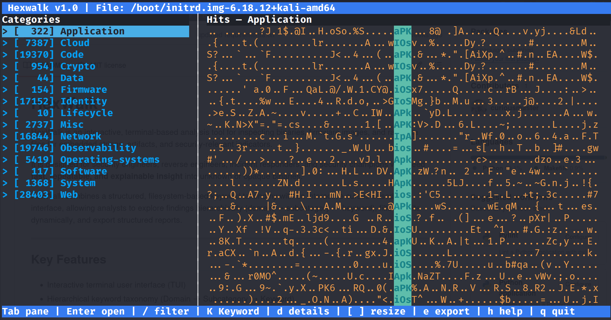
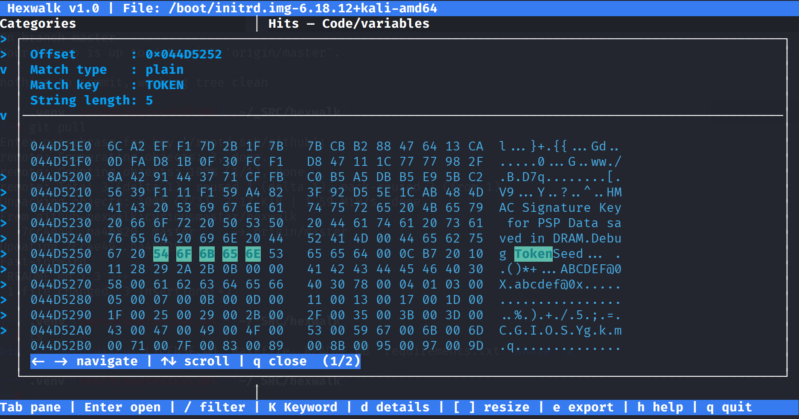
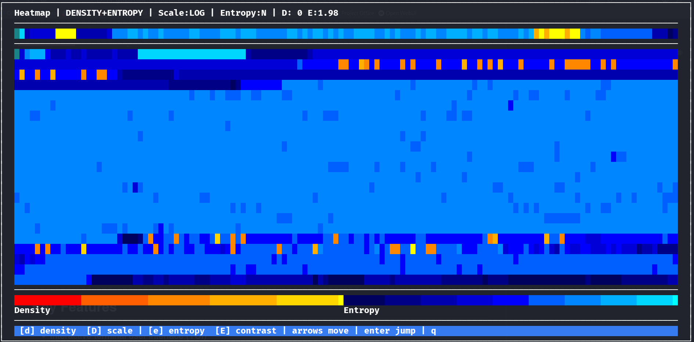

# HexWalk

HexWalk is an interactive, terminal-based analysis tool for inspecting binaries, firmware images, and raw data files for embedded strings, artifacts, and security-relevant indicators.

It is designed for security engineers, reverse engineers, incident responders, and security champions who need **fast, repeatable, and explainable insight** into unknown or opaque binaries.

HexWalk combines a structured, filesystem-based keyword taxonomy with an interactive curses-based user interface, allowing analysts to explore findings hierarchically (domain → subcategory → keyword), filter results dynamically, and export structured reports.

---


---





## Key Features

- Interactive terminal user interface (TUI)
- Hierarchical keyword taxonomy (Domain → Subcategory → Keyword)
- Keyword definitions stored as plain text files on disk
- Filterable taxonomy tree with live count updates
- Supports raw binaries, ELF files, and Intel HEX firmware images
- Context-aware hit display with hex + ASCII views
- Stable, non-wrapping layout designed for narrow terminals
- Summary page with per-domain, per-subcategory, and per-keyword breakdown
- Export of findings to structured JSON
- Export of summaries to human-readable text files
- Optional display of unused domains and keywords
- Clean separation between:
  - Keyword loading
  - Binary scanning
  - UI presentation
  - Reporting/export

---

## Keyword Structure

HexWalk uses a **filesystem-based keyword hierarchy**:

```
/usr/local/share/hexwalk/keywords/
├── identity/
│   ├── accounts.txt
│   ├── authentication.txt
│   └── authorization.txt
├── network/
│   ├── protocols.txt
│   └── services.txt
├── crypto/
│   ├── keys.txt
│   └── certificates.txt
...
```

- Each **directory** represents a *domain/category*
- Each `.txt` file represents a *subcategory*
   - Each line in a file represents a *keyword*
   - Keywords can be a regex if prepended by *regex:*
- Files with extension `.yara` contains YARA rules
- Comment lines (`#`) and empty lines are ignored

This structure is reflected directly in the TUI tree view.

---

## Supported File Types

HexWalk can analyze:

- Raw binary files (`.bin`, `.img`, memory dumps, etc.)
- ELF executables and shared objects
- Intel HEX firmware images (including extended linear address records)
- Text files

Intel HEX files are automatically detected and converted into a flat binary image before scanning.

---

## Installation

### Requirements

- Python **3.9 or newer**
- A terminal with curses support (most Linux terminals)
- Read access to the analyzed file
- Write access to the current directory (for exports)

### Install from Source

Clone the repository:

```
git clone git@github.com:curiousmaster/hexwalk.git
cd hexwalk
```

```

Install into `/usr/local`:

```
make install
```

This installs:

- `hexwalk` → `/usr/local/bin/hexwalk`
- Keyword definitions → `/usr/local/share/hexwalk/keywords/`

To uninstall:

```
make uninstall
```

---

## Usage

Basic usage:

```
hexwalk <file>
```

### Optional Flags

```
--summary     Write summary file and exit
--export      Write JSON export file and exit
```

Examples:

```
hexwalk firmware.bin
hexwalk --summary firmware.bin
hexwalk --export firmware.bin
```

---

## User Interface Overview

HexWalk runs entirely in the terminal and is divided into three primary panes:

1. **Categories** (left)
   - Hierarchical tree: Domain → Subcategory → Keyword
   - Live hit counts that respect active filters
   - Expand/collapse with arrow keys or Enter

2. **Hits** (center)
   - Contextual matches for the selected node
   - Automatically updates based on tree selection

3. **Details** (right)
   - Hex + ASCII view of the matched bytes
   - Byte-accurate offsets and highlighting

A full-screen **Summary View** is also available.

### Navigation Highlights

- `Tab` — switch between panes
- `Enter` — expand/collapse tree nodes or open hit modal
- `← / →` — collapse / expand tree levels
- `/` — filter keywords across the entire taxonomy
- `s` — show summary
- `e` — export results
- `h` — show heatmap
- `q` — quit

When a filter is active, it is displayed in the top header and all counts reflect the filtered view.

---

## Contributing

Contributions are welcome, especially:

- New keyword domains or subcategories
- Improvements to keyword coverage
- Enhancements to summary and export formats
- Performance optimizations
- UX and navigation refinements
- Documentation improvements

Please keep changes consistent with the existing design philosophy:
**predictable behavior, explicit structure, and analyst-first UX.**

---

## License

HexWalk is released under the **MIT License**.
See `LICENSE.md` for details.
